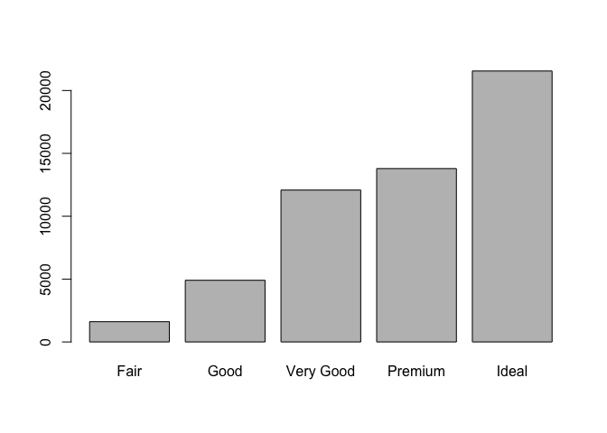
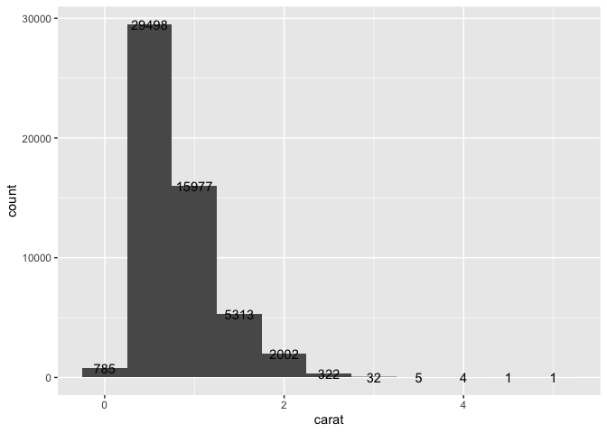
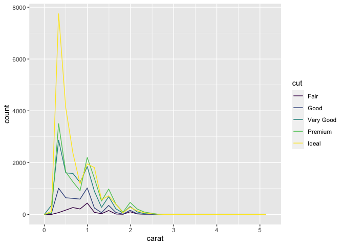
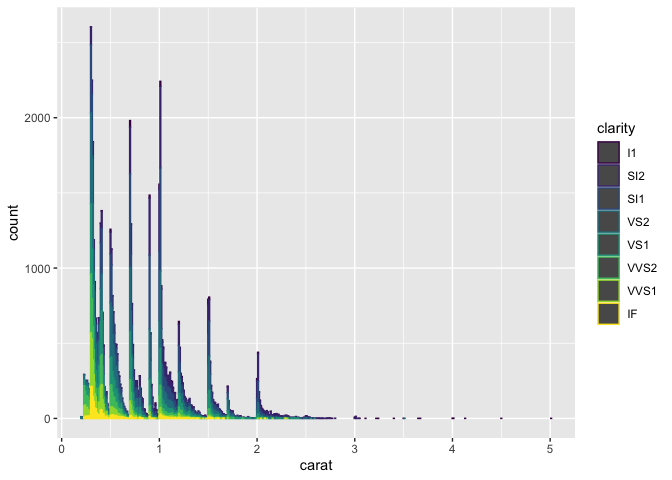
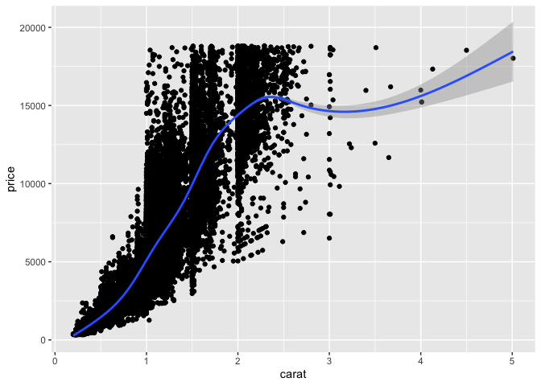
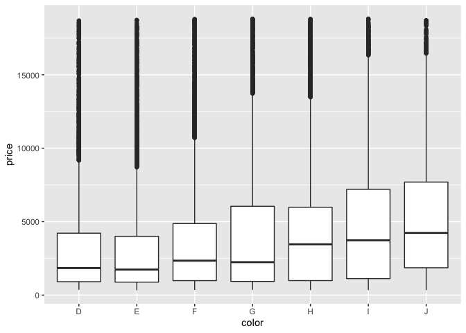
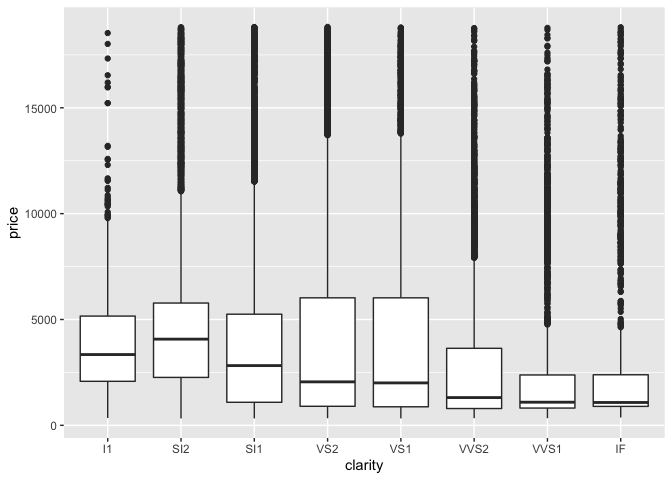
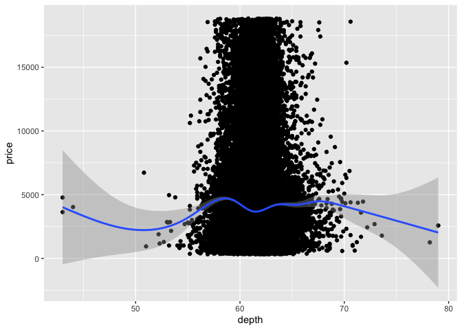

Diamond Data Analysis
================

## Diamond Data Analysis using R

This is my first venture into R for data analysis, I have done the data
analysis below using the Diamond Data present in R

## Code & Plots

``` r
library(ggplot2)
```

``` r
#1)Load the "diamonds" dataset contained in ggplot
dia<-ggplot2::diamonds


#2)Trace the number of diamonds according to their cut(diag in bars)

#ANS: 5 types of Diamond based on it's cut
plot(dia$cut)
```

<!-- -->

``` r
#3)   Make a histogram with carat in x and an interval of 0.5: How many diamonds are there between 0.25 and 0.75 carats?

#ANS: 29408 diamonds are present between 0.25 and 0.75 carats
ggplot(dia)+geom_histogram(mapping = aes(x=carat),binwidth = 0.5)+stat_bin(geom="text",aes(label=..count.., x=carat),binwidth = 0.5)
```

<!-- -->

``` r
#4) Make a frequency polygon diagram (geom_freqpoly) with the variable cut and x= carat.
ggplot(dia)+geom_freqpoly(mapping = aes(x=carat, color=cut))
```

    ## `stat_bin()` using `bins = 30`. Pick better value with `binwidth`.

<!-- -->

``` r
#5) Same with bars filled with diamonds clarity
ggplot(dia)+geom_bar(mapping = aes(x=carat, color=clarity))
```

<!-- -->

``` r
#6) Draw several graphs to try to see which variable has the most influence on price

#I have come to the below conclusion without considering the variable x,y and z. They are having exponential growth in price, I have plotted it as well.
#From the below graphs we are able to see that Diamond's Carat property plays a vital role in deciding the price of the Diamond. 
#Other variables such as cut, color and clarity also plays a minor part in deciding the price. 

#Carat vs Price

# this shows a linear dependency, so a major factor

ggplot(dia)+geom_point(mapping = aes(x=carat,y=price))+ geom_smooth(mapping = aes(x=carat,y=price))
```

    ## `geom_smooth()` using method = 'gam' and formula 'y ~ s(x, bs = "cs")'

<!-- -->

``` r
#Cut vs Price
#Cut is Categorical value, it doesn't show any significant influence
ggplot(dia)+geom_boxplot(mapping = aes(x=cut,y=price))
```

<!-- -->

``` r
#Color Vs Price
#Color is Categorical value,it doesn't show any significant influence
ggplot(dia)+geom_boxplot(mapping = aes(x=color,y=price))
```

<!-- -->

``` r
#Clarity Vs Price
#Clarity is Categorical value, it doesn't show any significant influence.
ggplot(dia)+geom_boxplot(mapping = aes(x=clarity,y=price))
```

<!-- -->

``` r
#Depth Vs Price
#Depth has no influence over Price
ggplot(dia, mapping = aes(x=depth,y=price))+geom_point()+geom_smooth()
```

    ## `geom_smooth()` using method = 'gam' and formula 'y ~ s(x, bs = "cs")'

<!-- -->

## Conclusion:

From above analysis we are able to see that the Diamond’s price is
primarily dependent on the its Carat Property.
