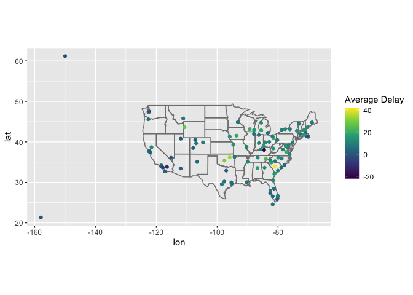
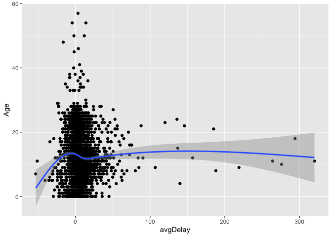
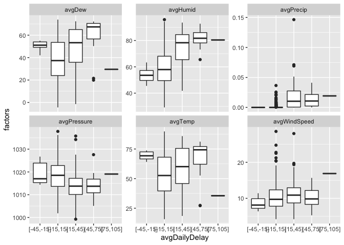
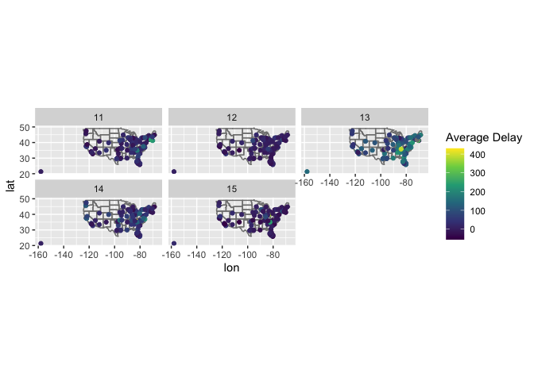

Flight Data Analysis
================

## Introduction:

This is my second venture into R for data analysis, I have done the data
analysis with various plots below using the flight, airport and weather
Data present in R.

## Load the libraries and basic variables:

``` r
library(nycflights13)
library(ggplot2)
library(tidyr)
library(dplyr)
```

    ## 
    ## Attaching package: 'dplyr'

    ## The following objects are masked from 'package:stats':
    ## 
    ##     filter, lag

    ## The following objects are masked from 'package:base':
    ## 
    ##     intersect, setdiff, setequal, union

``` r
flight<-nycflights13::flights
airport<-nycflights13::airports
weather<-nycflights13::weather
plane<-nycflights13::planes
```

## Analysis:

### 1\) Calculate the average delay by destination and then join with the airports table to plot the time distribution on a map.

``` r
by_day<-group_by(flight,dest)
avgDelay<-summarise(by_day, delay=mean(arr_delay,na.rm = TRUE))
airport %>% inner_join ( avgDelay , c ( "faa" = "dest" )) %>% ggplot ( aes ( lon , lat, colour=delay )) + borders ( "state" ) + geom_point () + coord_quickmap () + scale_color_viridis_c("Average Delay") 
```

<!-- -->

### 2\) Add lattitudes and longitudes of departure and arrival airports on the flight board

``` r
flightsAndAirports<-flight%>%left_join(select(airport,faa,lat,lon),by=c("origin"="faa"))%>%rename(origin_lat=lat,origin_lon=lon)
flightsAndAirports<-flightsAndAirports%>%left_join(select(airport,faa,lat,lon),by=c("dest"="faa"))%>%rename(dest_lat=lat,dest_lon=lon)
```

### 3\) Is there a relationship between the age of an aircraft and its average delay (on arrival)?

Based on the below plot we are able to conclude that there is no
relationship between age of the plane and the delay. The delay should
have been caused by other factors.

``` r
by_plane<-group_by(flight,tailnum)
avgPlaneDelay<-summarise(by_plane,avgDelay=mean(arr_delay,na.rm = TRUE))
avgPlaneDelay<-avgPlaneDelay%>%left_join(select(plane,tailnum,year),by="tailnum")
avgPlaneDelay<-mutate(avgPlaneDelay, Age=2013-year)
avgPlaneDelay %>% ggplot(aes(x=avgDelay,y=Age))+geom_point()+geom_smooth()
```

    ## `geom_smooth()` using method = 'gam' and formula 'y ~ s(x, bs = "cs")'

<!-- -->

### 4\) What influence does weather have on flight delays (look at the precipitation variable)?

From the below plots we are able to see that the Humidity and
Precipitation seems to be the factor causing the delay in flights.

``` r
by_dayAndMonth<-group_by(flight,month,day)
avgDelayDaily<-summarise(by_dayAndMonth,avgDailyDelay=mean(arr_delay, na.rm = TRUE))
by_weather<-group_by(weather,month,day)
avgWeather<-summarise(by_weather,avgTemp=mean(temp,na.rm=TRUE),avgDew=mean(dewp,na.rm=TRUE),avgHumid=mean(humid,na.rm=TRUE),avgWindSpeed=mean(wind_speed,na.rm=TRUE),avgPrecip=mean(precip,na.rm=TRUE),avgPressure=mean(pressure,na.rm=TRUE))
avgDelayDaily<-avgDelayDaily%>%left_join(avgWeather, by=c("month","day"))
avgDelayDaily%>%ungroup() %>%mutate(avgDailyDelay = cut_width(avgDailyDelay, 30)) %>%gather(weather, factors, -(month:avgDailyDelay)) %>%ggplot(aes(x=avgDailyDelay,y=factors))+geom_boxplot()+ facet_wrap(~ weather,scales = "free_y")
```

<!-- -->

### 5\) What happened on June 13, 2013?

On comparing the delays on the consecutive days(before and after) June
13, we are able to see a significant delay of the flights on the eastern
parts of USA.

On google we are able to see there was severe weather and USA had 6
tornado’s on the day on the East coast.Below is the link of the news
Article.
<https://www.spc.noaa.gov/exper/archive/event.php?date=20130613>

``` r
avgDelayInflight<-flight %>%mutate(tot_delay = arr_delay + dep_delay) %>%group_by(month, day, dest) %>%summarize(avg_delay = mean(tot_delay, na.rm = TRUE)) 
avgDelayInflight<-avgDelayInflight%>%filter(month == 6, day >=11 & day<=15) %>%left_join(select(airports, faa, lat, lon), by = c("dest" = "faa"))
avgDelayInflight%>%ggplot(aes(lon, lat, colour = avg_delay)) +borders("state") +geom_point() +coord_quickmap()+ facet_wrap(~ day, nrow = 2)+ scale_color_viridis_c("Average Delay")
```

<!-- -->
